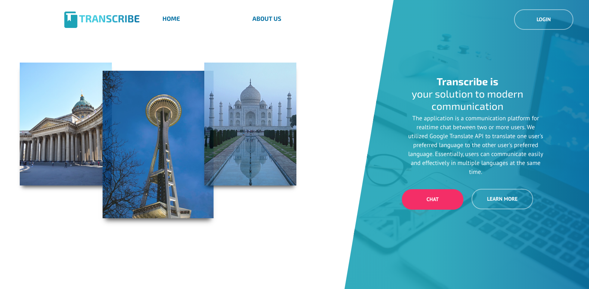
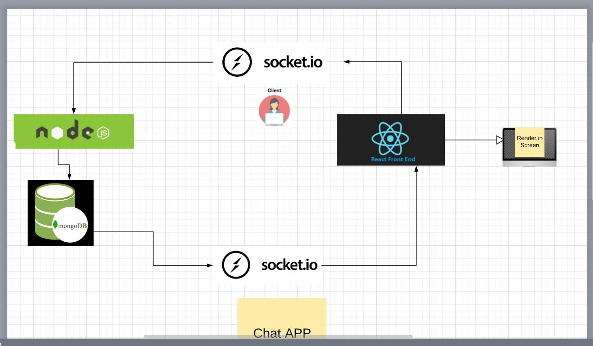

# Project "Transcribe"

## [Production Link](https://transcribe-chat.com) 


## BackEnd - Node Application
The backend part of our application is a NodeJS platform for realtime chat between two or more users. 
We utilized NodeJS, Socket.io, JavaScript and Google Translate API

## FrontEnd - React Application
The frontend part of our application utilizes React.js and SCSS

## Main Dependencies

- [NodeJS](https://nodejs.org/en/)
- [Express](https://expressjs.com/) 
- [Socket.io](https://socket.io/)
- [Google Translate API](https://www.npmjs.com/package/google-translate)
- [Auth0](https://auth0.com/)


---------------------------------

## Getting Started

Clone this repository to your local machine.
```
$ git clone git@github.com:401n14/finFrontend.git
```
Use `yarn` or `npm` to install the project dependencies:
```

```bash
# Using npm..
npm install

```

### Compiles and hot-reloads for development

```bash
npm run start
```

## Deployment

### Compiles and minifies for production

```bash
npm run build
```

### Run your tests

```bash
npm run test
```

---------------------------------
 
## Login and chat away!




---------------------------------

## Authors
* Nadya Ilinskaya
* James Dunn
* Anna Li
* Morgan T Shaw
* Martin Balke
* Meron Sibani

aka **nightJAMMM team**

<center>© CodeFellows | 2020</center>


* 
